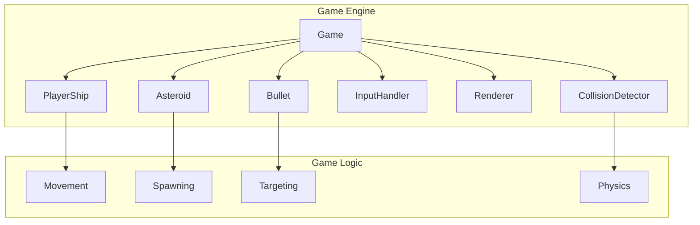

# Space Dodge Game Architecture

## Overview

Space Dodge is a 2D terminal-based game implemented with Python's curses module. It features a player-controlled spaceship that must dodge falling asteroids while shooting them to earn points.

## Component Architecture

### Core Classes

### Key Components
1. **Game Controller**: Manages game state and main loop
2. **Rendering System**: Handles terminal-based graphics with curses
3. **Physics Engine**: Simple collision detection between game objects
4. **Input System**: Captures and processes keyboard input

## Design Principles
- Object-oriented architecture with clear class separation
- Single Responsibility Principle for game components
- Separation of concerns between game logic and rendering
- Clean architecture for maintainability

## Implementation Details
- Uses Python's curses module for terminal-based graphics
- Frame-based game loop with variable FPS
- Object pooling for asteroids and bullets
- Score tracking and game state management (menu, playing, game over)

## Future Enhancements
- Add power-ups and special weapons
- Implement levels with increasing difficulty
- Add sound effects and better graphics
- Implement high score persistence